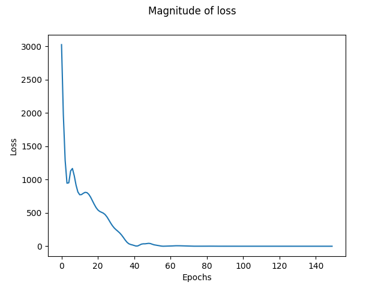
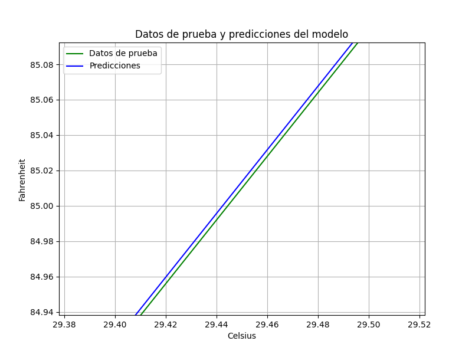
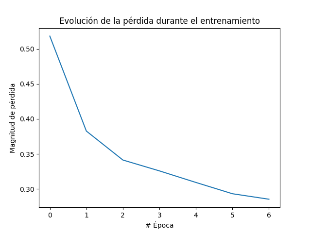

# Ejemplos de TensorFlow
Conjunto de varios ejemplos simplificados sobre el uso tensorflow en cuestión de entrenamiento y predicción. Se actualizará regularmente para incluir nuevos ejemplos y mejoras.

<video controls src="example_tensorflow_lite.mp4" title="Title"></video>

# Motivación
Proporcionar una colección de ejemplos simplificados de TensorFlow que sirvan a modo de consulta para aquellos que deseen aprender o trabajar con esta potente biblioteca de aprendizaje automático. 

# Modelos Contenidos
## Regresión
### Conversión de Celsius a Fahrenheit

Entrenamiento

Predicciones

## Clasificación
### Clasificador de ropa usando el dataset de [`Fashion MNIST`](https://github.com/zalandoresearch/fashion-mnist)

Entrenamiento

Predicciones

