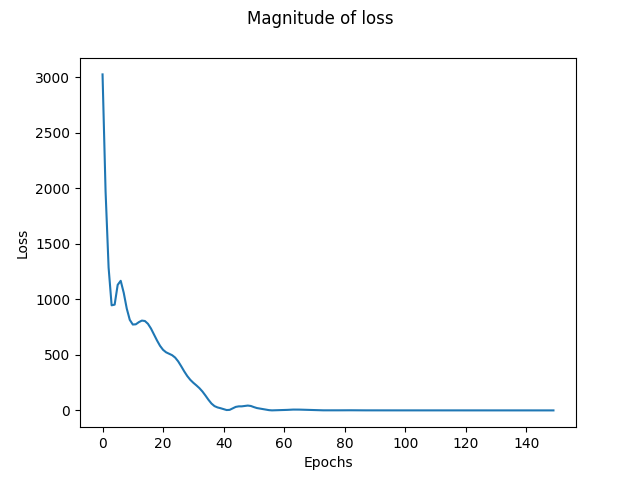
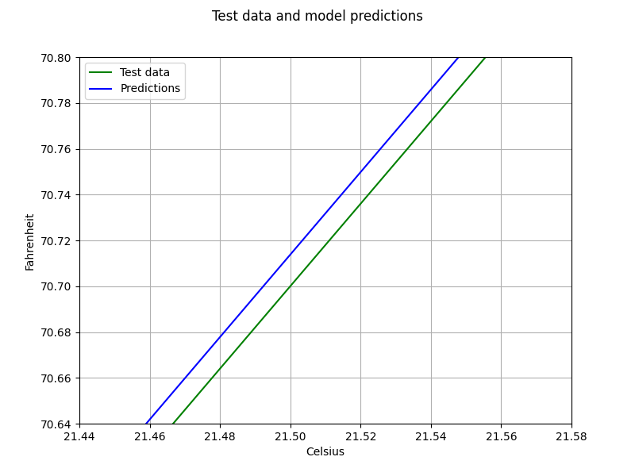
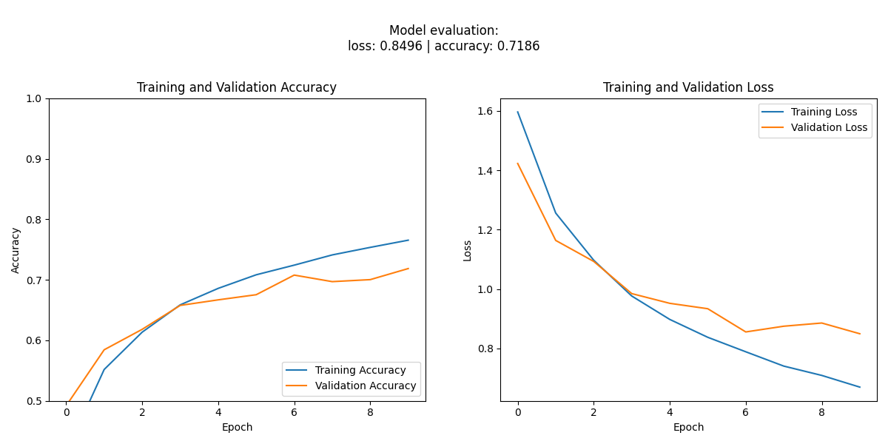
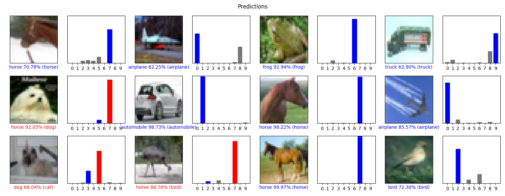
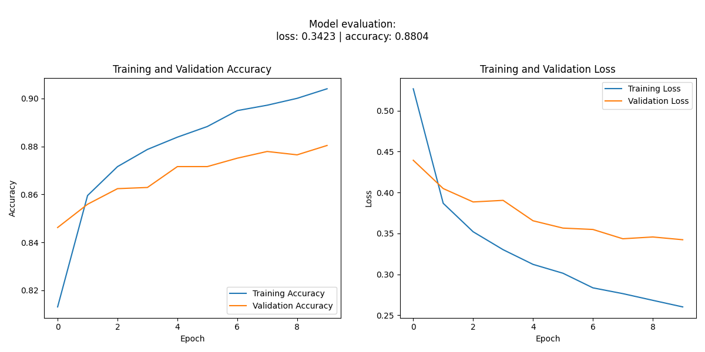
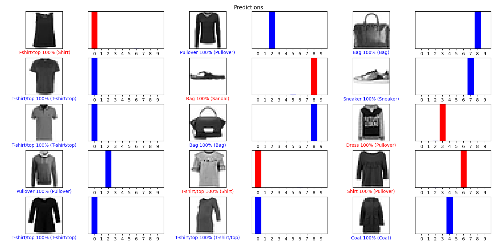

# Ejemplos de TensorFlow
Conjunto de varios ejemplos simplificados sobre el uso tensorflow en cuestión de entrenamiento y predicción. Se actualizará regularmente para incluir nuevos ejemplos y mejoras.

# Motivación
Proporcionar una colección de ejemplos simplificados de TensorFlow que sirvan a modo de consulta para aquellos que deseen aprender o trabajar con esta potente biblioteca de aprendizaje automático. 

# Modelos Contenidos
## Regresión
### simple: Conversión de Celsius a Fahrenheit

Entrenamiento

Predicciones

## Clasificación
### cnn_simple: Clasificador de varias tipos usando el dataset de [`CIFAR-10`](https://www.tensorflow.org/datasets/catalog/cifar10?hl=es-419)

Entrenamiento

Predicciones

### regular_neural_network: Clasificador de ropa usando el dataset de [`Fashion MNIST`](https://github.com/zalandoresearch/fashion-mnist)

Entrenamiento

Predicciones

